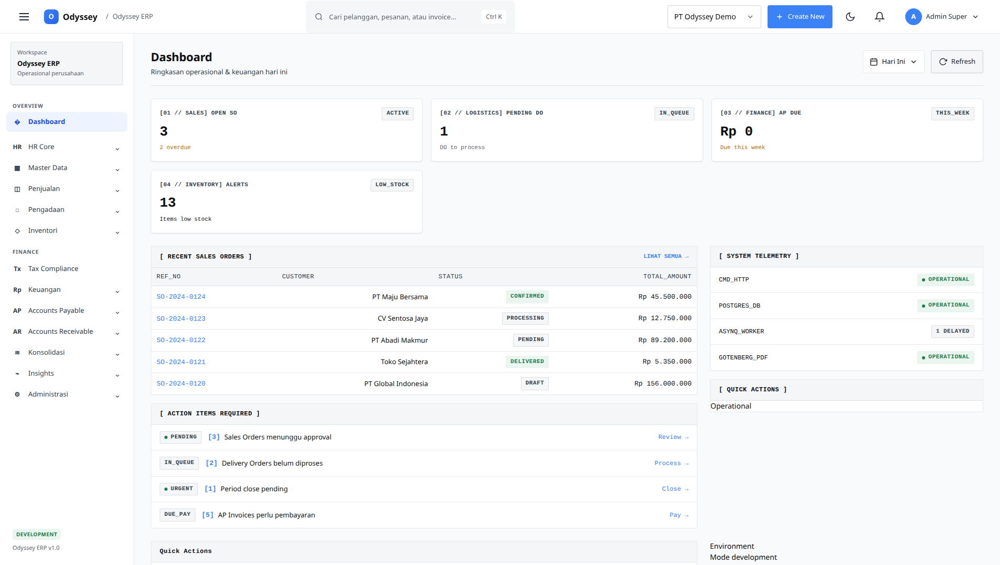

# Odyssey ERP

[](https://github.com/noah-isme/odyssey-erp/actions/workflows/ci.yml)
[](docs/releases/v0.10.0-rc.3.md)
[](go.mod)
[](LICENSE)

## Finance-led operations for growing businesses

Odyssey ERP helps teams run finance and daily operations in one place—from purchasing,
sales, inventory, and delivery through accounting, reporting, approvals, and audit.
It exists to give operators a dependable shared record of money, documents, stock, and
business activity without stitching together disconnected systems.

## Key features

- **Control the financial cycle:** GL, AR, AP, tax, banking, reconciliation, budgets, FX, and consolidation.
- **Move goods and documents:** procurement, quotations, sales orders, delivery, inventory, lots/serials, and costing.
- **Coordinate teams:** CRM pipeline, approvals, HR core, payroll, notifications, and company-scoped access.
- **Plan and execute production:** approved BOM revisions, warehouse-aware MRP, WIP, finite-capacity scheduling, quality traceability, manufacturing analytics, and compliance foundations.
- **See the business clearly:** finance analytics, board packs, aging, cash flow, budget-vs-actual, and audit timelines.
- **Extend safely:** public API, idempotent operations, signed webhooks, portals, and multi-company isolation.

## Visual preview



The preview shows Odyssey ERP's public landing page, including its product overview,
sales, inventory, accounting, fulfillment, reporting, governance, and integration
sections. Authenticated application previews are generated by the E2E suite; see
the [E2E Browser Testing guide](docs/guides/e2e-browser-testing.md) for setup and
capture instructions.

For self-managed VPS deployment, use the [VPS production deployment guide](docs/DEPLOYMENT.md).

The current release candidate is [v0.10.0-rc.3](docs/releases/v0.10.0-rc.3.md).
For production promotion, use the [Production Release Checklist](docs/releases/production-release-checklist.md);
this candidate is not production-certified yet.

See the [CHANGELOG](docs/CHANGELOG.md), [version and progress report](docs/releases/VERSION_HISTORY.md), [release notes](docs/releases/), and the [authoritative feature matrix](docs/reference/feature-matrix.md).

## Feature overview

- **Core accounting:** GL, AR, AP, tax, banking, reconciliation, cash flow, budgets, fixed assets, FX, consolidation, analytics, and board packs.
- **Operations:** Procurement, quotations, sales orders, delivery, inventory movements, stock takes, adjustments, lot/serial tracking, AVG/FIFO costing, and replenishment foundations.
- **People and relationships:** CRM pipeline and activities, approvals, HR core, payroll, notifications, and company-scoped access.
- **Manufacturing / MRP:** approved BOM revisions, planning and recommendation firming, WIP execution/cost transfer, finite-capacity scheduling, exceptions, quality/genealogy, analytics, and controlled-record foundations. See the [Manufacturing / MRP guide](docs/guides/manufacturing-mrp.md).
- **Horizon foundations:** WMS bins/picking/barcodes, POS tickets/payments/refunds, projects/timesheets, portals, public APIs, and signed webhooks.

## In progress

- Sales lifecycle depth, inventory costing breadth, project and POS workflows, supply-chain operations, BI/reporting coverage, multi-everything support, integrations, and enterprise security controls.

## Planned

- E-commerce connectors, fleet and route optimization, CMMS, advanced QMS, general document management, 2FA, SSO, encryption-at-rest policy, automated disaster recovery, and regulated-policy enforcement for manufacturing compliance controls.

## Example end-to-end business flow

This example follows the documented Odyssey workflows. CRM conversion creates a draft
quotation; quotation approval is required before order conversion; delivery completion
posts inventory movement; and AR posting/payment allocation feeds accounting records.
Replenishment creates draft purchase requests and does not bypass procurement approval.

```text
CRM Lead
    |
    v
Qualify -> Opportunity -> WIN
    |
    v
Link or create customer
    |
    v
Draft Sales Quotation
    |
    v
Submit -> Approve
    |
    v
Convert to Draft Sales Order
    |
    v
Confirm Sales Order
    |
    v
Create Delivery Order / select warehouse
    |
    +-- Available ------------------------------+
    |                                           |
    +-- Below minimum stock                     |
            |                                   |
            v                                   |
    Create draft Purchase Request               |
            |                                   |
            v                                   |
    Submit / approve -> Draft Purchase Order    |
            |                                   |
            v                                   |
    Submit / approve -> Post Goods Receipt      |
            |                                   |
            +------ Inventory inbound movement -+
                                                |
                                                v
                                      Create Delivery Order
                                                |
                                                v
                                      Confirm -> Ship -> Deliver
                                                |
                                                v
                                      Inventory movement posted
                                                |
                                                v
                                      Create AR invoice from delivery
                                                |
                                                v
                                      Post AR invoice
                                                |
                                                v
                                      Allocate customer payment
                                                |
                                                v
                                      Invoice becomes PAID when fully allocated
                                                |
                                                v
                                      Journal, tax, and audit records written;
                                      reports/read models update through their jobs
```

For feature-level release status, supported lifecycle states, report routes, and
integration boundaries, see the [authoritative feature matrix](docs/reference/feature-matrix.md),
[module catalog](docs/reference/module-catalog.md),
[lifecycle reference](docs/architecture/lifecycles.md),
[reporting catalog](docs/reference/reporting-catalog.md), and
[integration boundaries](docs/guides/integrations.md).

## Quick Start

### Try it out with Docker

This path is for evaluators and end-users. It builds the app, starts its dependencies,
applies migrations, and loads development seed data:

```bash
docker compose --profile full up --build
```

Open <http://localhost:8080> after the services are ready.

**Development login:** `admin@odyssey.local` / `admin123`

### Local development

This path is for contributors who want hot reload, tests, and direct access to the Go
toolchain. Install Go 1.25+, Docker, and Make, then follow
[`QUICK_REFERENCE.md`](QUICK_REFERENCE.md) or the [native setup guide](docs/getting-started/native-setup.md).

## Documentation

All documentation is in [`docs/`](docs/README.md):

| Section | Description |
|---------|-------------|
| [Getting Started](docs/getting-started/quick-start.md) | Setup & installation |
| [Architecture](docs/architecture/arsitektur.md) | System design |
| [Guides](docs/guides/) | How-to guides & runbooks |
| [Reference](docs/reference/) | Technical reference |
| [ADRs](docs/decisions/) | Architecture decisions |

## Development

```bash
# Hot reload (recommended)
~/go/bin/air
```

See [`QUICK_REFERENCE.md`](QUICK_REFERENCE.md) for the full command cheatsheet.

## Docker Services

| Service | Port | Description |
|---------|------|-------------|
| App | 8080 | Odyssey ERP |
| PostgreSQL | 5432 | Database |
| Redis | 6380 | Cache (host 6380 → container 6379) |
| Mailpit | 8025 | Email testing |
| Gotenberg | 3000 | PDF generator |

## Tech Stack

- **Architecture:** Modular Monolith (Clean Architecture)
- **Backend:** Go 1.25+, Chi router
- **Database:** PostgreSQL 15, sqlc
- **Cache:** Redis 7
- **Background jobs:** Asynq
- **Frontend:** Server-side rendered HTML with a custom component CSS design system (`web/static/css`)
- **PDF:** Gotenberg
- **Container:** Docker with Alpine Linux

## License

See LICENSE file for details.
