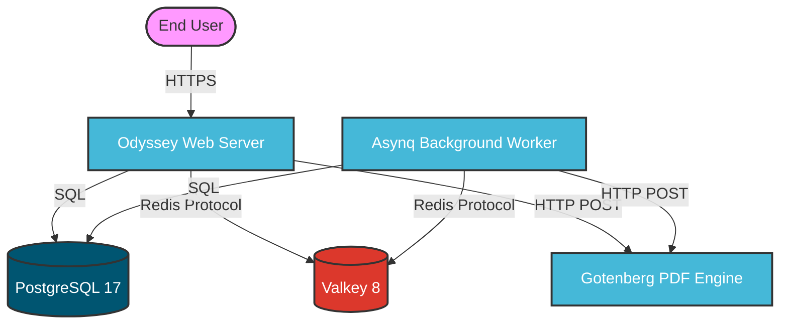
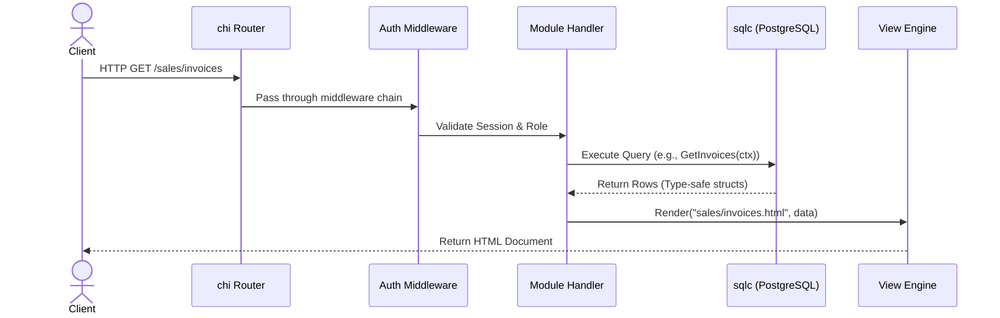
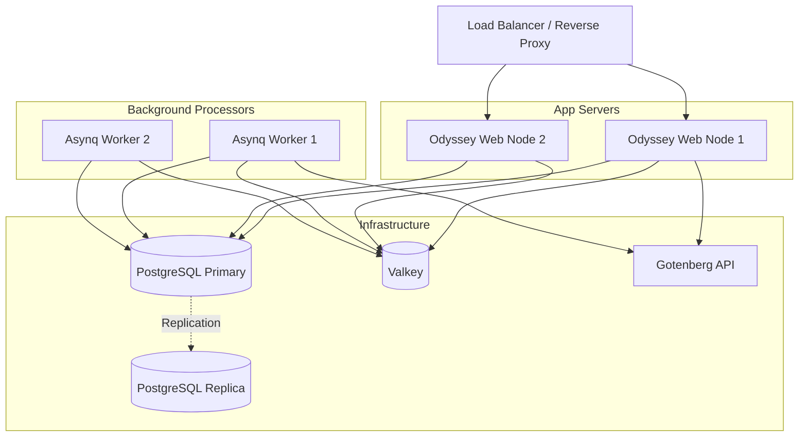

# Odyssey ERP Architecture

This document provides a comprehensive overview of the architecture for Odyssey ERP, an open-source Enterprise Resource Planning system.

## Overview

Odyssey ERP is designed as a Go modular monolith. It focuses on simplicity, maintainability, and performance by utilizing Server-Side Rendering (SSR) with Go templates, augmented with HTMX and Alpine.js for interactivity. The system is split into two primary executables built from the same codebase:
1. `cmd/odyssey`: The primary HTTP server for serving the web application.
2. `cmd/worker`: A background worker powered by Asynq to handle asynchronous tasks.

---

## System Context Diagram



---

## Technology Stack

| Layer | Technology |
|-------|------------|
| Language | Go 1.24+ |
| HTTP Router | go-chi/chi/v5 |
| Templates | Go html/template (Server-Side Rendering) |
| Database | PostgreSQL 17 |
| DB Access | sqlc (Type-safe SQL codegen) |
| Migrations | golang-migrate |
| Cache & Queue | Valkey 8 (Redis-compatible) |
| Background Jobs| hibiken/asynq |
| PDF Reports | Gotenberg 8 (HTML to PDF) |
| Sessions | gorilla/sessions + Redis store |
| Authentication | bcrypt password hashing |
| Financial Math | shopspring/decimal |
| Logging | rs/zerolog |
| Frontend | HTMX + Alpine.js (Progressive enhancement) |
| CSS | Custom design tokens (CSS custom properties) |
| Charts | Chart.js |
| Hot Reload | Air |

---

## Directory Structure

```text
.
├── cmd/
│   ├── odyssey/         # HTTP server entrypoint
│   └── worker/          # Asynq worker entrypoint
├── internal/
│   ├── app/             # Application wiring (DI, routes, dependencies)
│   ├── auth/            # Authentication module
│   ├── admin/           # User administration
│   ├── dashboard/       # Dashboard module
│   ├── sales/           # Sales module (customers, invoices, payments, credit notes)
│   ├── procurement/     # Procurement module (suppliers, POs, goods receipts)
│   ├── inventory/       # Inventory module (products, warehouses, stock)
│   ├── finance/         # Finance module (accounts, journals, ledger, statements)
│   ├── governance/      # GRC module (policies, risks, controls, audits)
│   ├── reports/         # Report configuration
│   └── shared/          # Cross-cutting concerns
│       ├── config/      # Environment-based configuration
│       ├── db/          # DB connection & sqlc generated code
│       ├── errors/      # Custom error types
│       ├── handler/     # Base handler utilities
│       ├── middleware/  # HTTP middleware stack
│       └── types/       # Common types (pagination, etc.)
├── jobs/                # Background job definitions
├── report/              # Gotenberg client and PDF generation handlers
├── sql/
│   └── queries/         # sqlc SQL query files
├── migrations/          # PostgreSQL schema migrations
└── web/
    ├── templates/       # SSR templates (layouts, partials, pages)
    └── static/
        ├── css/         # Design system CSS files
        └── js/          # Client-side JavaScript
```

---

## Module Architecture (Dependency Injection)

Odyssey follows a modular monolith pattern. Modules are isolated by domain and wired together in `internal/app/`.

```mermaid
graph TD
    App[internal/app<br/>(Application Wiring & DI)]
    
    subgraph Modules [Domain Modules]
        Auth[internal/auth]
        Sales[internal/sales]
        Fin[internal/finance]
        Inv[internal/inventory]
        Proc[internal/procurement]
        Gov[internal/governance]
    end
    
    subgraph Shared [Shared Infrastructure]
        Config[config]
        DBConn[db (sqlc)]
        Middle[middleware]
        Types[types]
    end
    
    App --> Modules
    App --> Shared
    Modules --> Shared
    
    classDef app fill:#f9e79f,stroke:#333;
    classDef mod fill:#aed6f1,stroke:#333;
    classDef share fill:#a2d9ce,stroke:#333;
    
    class App app;
    class Auth,Sales,Fin,Inv,Proc,Gov mod;
    class Config,DBConn,Middle,Types share;
```

1. **`app.go`**: Contains the `App` struct holding dependencies (DB pool, Redis client, templates, sessions, Asynq client).
2. **`dependencies.go`**: Initializes infrastructure components (PostgreSQL via pgxpool, Valkey/Redis, session store, template cache).
3. **`routes.go`**: Registers `chi` routes. Each domain module receives a route sub-group equipped with appropriate middleware.

---

## Data Flow

The following sequence details how a typical synchronous web request is handled within the system:



### Background Processing Data Flow
For asynchronous actions (e.g., heavy report generation):
1. **Module Handler** enqueues a task to Valkey via Asynq.
2. Immediate HTTP response is returned to the client (often polling or HTMX trigger for updates).
3. **Asynq Worker** pulls the task from Valkey.
4. **Worker** processes the task (e.g., contacts Gotenberg for PDF), stores results in DB or sends an email.

---

## Database Architecture

- **Engine**: PostgreSQL 17.
- **Migrations**: 29 versioned migrations managed by `golang-migrate`.
- **Primary Keys**: UUID v4 (using `google/uuid`).
- **Monetary Types**: Handled strictly via `shopspring/decimal` in Go, mapping to `NUMERIC` in PostgreSQL to prevent floating-point inaccuracies.
- **Data Access**: `sqlc` generates type-safe Go code directly from raw SQL files located in `sql/queries/`.
- **Key Entities**: `users`, `customers`, `invoices`, `invoice_items`, `suppliers`, `purchase_orders`, `products`, `warehouses`, `accounts`, `journal_entries`, `policies`, `risks`, `controls`, `audits`.

---

## API & Routing Structure

The application heavily utilizes `chi`'s sub-router capabilities:

```text
/                      → /dashboard (Redirect for authenticated users)
├── /login, /register, /logout (Public)
├── /dashboard         (Authenticated view)
├── /sales/            (Invoices, customers, payments, credit-notes)
├── /procurement/      (Suppliers, purchase-orders, goods-receipts)
├── /inventory/        (Products, warehouses, stock-movements)
├── /finance/          (Accounts, journal-entries, ledger, reports)
├── /governance/       (Policies, risks, controls, audits, incidents)
├── /reports/generate  (POST for generating async reports)
├── /admin/users       (CRUD for user administration)
└── /static/           (Static file server for CSS/JS)
```

---

## Authentication & Session Management

- **Storage**: `gorilla/sessions` utilizing Valkey (Redis) as the distributed backend store.
- **Security**: Passwords hashed securely using `bcrypt`.
- **Authorization**: Middleware-based route protection. Roles (e.g., Admin, User) dictate access to specific route groups (like `/admin`).

---

## Frontend Architecture

Odyssey eschews complex Single Page Application (SPA) frameworks in favor of a progressive enhancement model:
- **Server-Side Rendering (SSR)**: Standard Go `html/template` forms the backbone of the UI.
- **HTMX**: Used for seamless partial page updates, dynamic data loading, and form submissions without full page reloads.
- **Alpine.js**: Handles lightweight client-side state and interactivity (modals, dropdowns, toggles, sidebar).
- **Styling**: Vanilla CSS built on top of robust design tokens (CSS custom properties), completely removing the need for a utility-class compiler step.
- **Visuals**: Chart.js for dashboard metrics and SortableJS for drag-and-drop interfaces (e.g., Kanban boards).

---

## Background Processing & Report System

### Asynq Workers
- Configured in `jobs/`.
- The separate `worker` executable connects to the same PostgreSQL and Valkey instances.
- Handles retries, scheduled tasks, and offloads heavy computation from the web server.

### PDF Report Generation
- **Gotenberg 8**: A Docker-based stateless API for PDF generation.
- The `report/` package creates HTML via Go templates, issues an HTTP POST to the Gotenberg instance, and retrieves the fully rendered PDF.

---

## Deployment Architecture



---

## Cross-Cutting Concerns

- **Configuration**: Handled by `internal/app/config.go`, pulling settings exclusively from environment variables (12-Factor App methodology).
- **Logging**: High-performance structured JSON logging utilizing `rs/zerolog`. Log lines include request IDs, user IDs (where applicable), and duration.
- **Error Handling**: A unified custom error system located in `internal/shared/errors.go`, providing consistent mapping between internal logic failures and HTTP status codes/user-facing messages.
