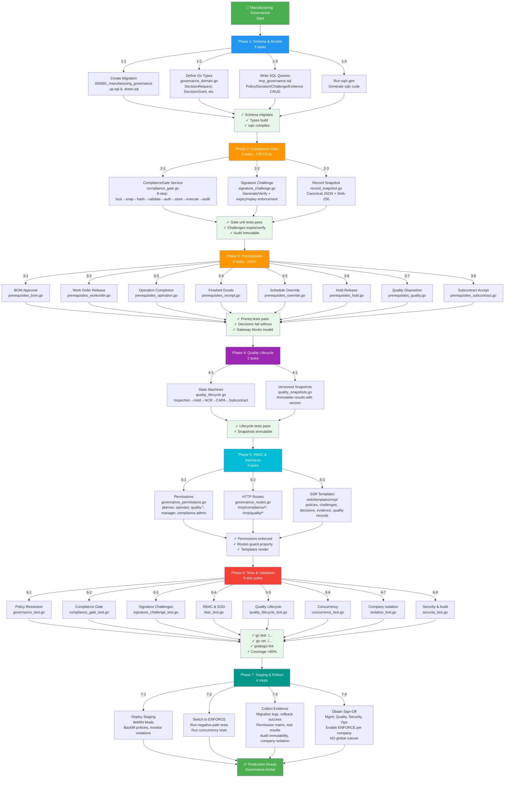
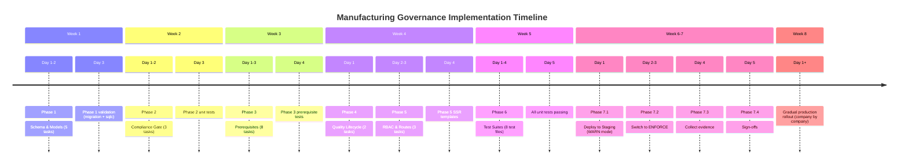

# Manufacturing Governance - Visual Execution Map



## Execution Timeline



## Task Dependencies

```
Phase 1 (Schema)
    ↓
Phase 2 (Gate) ← [Requires: Schema, types, SQL]
    ↓
Phase 3 (Prerequisites) ← [Requires: Gate]
    ↓
Phase 4 (Lifecycle) ← [Requires: Schema tables]
    ↓
Phase 5 (RBAC) ← [Requires: All above]
    ↓
Phase 6 (Tests) ← [Requires: All above]
    ↓
Phase 7 (Staging) ← [Requires: All above + tests passing]
```

## File Inventory (33 Total)

### Schema & Migration (2 files)
- `migrations/000081_manufacturing_governance.up.sql`
- `migrations/000081_manufacturing_governance.down.sql`

### Go Services (14 files)
- `internal/mrp/governance_domain.go` – Domain types
- `internal/mrp/compliance_gate.go` – Central gate service
- `internal/mrp/signature_challenge.go` – Challenge/reauthentication
- `internal/mrp/record_snapshot.go` – Snapshot & hashing
- `internal/mrp/prerequisites_bom.go`
- `internal/mrp/prerequisites_workorder.go`
- `internal/mrp/prerequisites_operation.go`
- `internal/mrp/prerequisites_receipt.go`
- `internal/mrp/prerequisites_override.go`
- `internal/mrp/prerequisites_hold.go`
- `internal/mrp/prerequisites_quality.go`
- `internal/mrp/prerequisites_subcontract.go`
- `internal/mrp/quality_lifecycle.go`
- `internal/mrp/quality_snapshots.go`

### Go RBAC & Routes (2 files)
- `internal/mrp/governance_permissions.go`
- `internal/mrp/governance_routes.go`

### SQL Queries (1 file)
- `sql/queries/mrp_governance.sql`

### Generated (1 file)
- `internal/sqlc/mrp_governance.go` – Auto-generated by sqlc

### SSR Templates (8 files)
- `web/templates/mrp/compliance/policies.html`
- `web/templates/mrp/compliance/challenges.html`
- `web/templates/mrp/compliance/decisions.html`
- `web/templates/mrp/compliance/evidence.html`
- `web/templates/mrp/quality/inspections.html`
- `web/templates/mrp/quality/holds.html`
- `web/templates/mrp/quality/nonconformances.html`
- `web/templates/mrp/quality/capas.html`

### Test Files (8 files)
- `internal/mrp/governance_test.go`
- `internal/mrp/compliance_gate_test.go`
- `internal/mrp/signature_challenge_test.go`
- `internal/mrp/rbac_test.go`
- `internal/mrp/quality_lifecycle_test.go`
- `internal/mrp/concurrency_test.go`
- `internal/mrp/isolation_test.go`
- `internal/mrp/security_test.go`

### Documentation (Updated)
- `docs/guides/MANUFACTURING-GOVERNANCE-EXECUTION-PLAN.md` – This detailed guide

---

## Key Validation Gates

| Gate | Success Criteria | Blocker? |
|---|---|---|
| **Schema** | Migration runs, no SQL errors | Yes |
| **sqlc** | `make sqlc-gen` produces code, no Go errors | Yes |
| **Gate Unit Tests** | All gate tests pass (challenges, snapshots, audit) | Yes |
| **Prerequisite Tests** | All 8 decision types validated correctly | Yes |
| **Lifecycle Tests** | State machines enforce valid transitions | Yes |
| **RBAC Tests** | Permissions enforced on all routes, SOD violations rejected | Yes |
| **Concurrency Tests** | Concurrent operations idempotent, no race conditions | Yes |
| **Company Isolation** | Cross-company queries return empty, exports correct | Yes |
| **Full Test Suite** | `go test ./...` passes, coverage >80% | Yes |
| **Staging WARN Mode** | All existing functions work, violations logged | No – warning only |
| **Staging ENFORCE Mode** | All governance rules enforced, no data loss | Yes |
| **Evidence Collection** | All mandatory docs completed | Yes – for sign-off |
| **Sign-Offs** | Manufacturing, Quality, Security, Ops approved | Yes – for production |

---

## How to Track Progress

The detailed plan is tracked in the todo system with 33 actionable tasks grouped by phase. Each task has:
- Clear file targets
- Specific acceptance criteria
- Dependency tracking
- Confidence level (95% = well-understood, 80% = likely needs clarification)

**To view progress:**
```bash
# View all tasks
jcode todo list

# View specific phase
jcode todo list | grep "Phase 1"

# Mark task complete
jcode todo complete id-of-task
```

---

## Questions Before Starting?

Before diving into Phase 1 (schema creation), clarify:

1. **Policy activation:** Should existing non-regulated companies bypass governance entirely, or be set to WARN mode initially?
2. **Reauthentication:** Use existing password service for v1, or implement separate challenge mechanism?
3. **Audit retention:** How long should audit events be kept? (Recommended: 7 years for manufacturing)
4. **Performance targets:** Any SLA for compliance gate decisions? (Recommended: <100ms per decision)
5. **Rollback procedure:** Automated or manual? Test required frequency?

